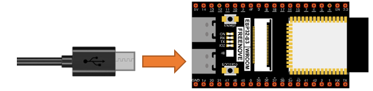

##############################################################################
Chapter LED
##############################################################################

This chapter is the Start Point in the journey to build and explore ESP32-S3 WROOM electronic projects. We will start with simple “Blink” project.

Project 0.1 Blink
******************************

In this project, we will use ESP32-S3 WROOM to control blinking a common LED.

Component List
===============================

.. list-table:: 
   :width: 100%
   :header-rows: 1 
   :align: center
   
   * -  ESP32-S3 WROOM x1
     -  USB cable x1S

   * -  |Chapter00_00|
     -  |Chapter00_01|

.. |Chapter00_00| image:: ../_static/imgs/0_LED/Chapter00_00.png
.. |Chapter00_01| image:: ../_static/imgs/0_LED/Chapter00_01.png

Power
------------------------------

ESP32-S3 WROOM needs 5v power supply. In this tutorial, we need connect ESP32-S3 WROOM to computer via USB cable to power it and program it. We can also use other 5v power source to power it.

In the following projects, we only use USB cable to power ESP32-S3 WROOM by default.

In the whole tutorial, we don't use T extension to power ESP32-S3 WROOM. So 5V and 3.3V (includeing EXT 3.3V) on the extension board are provided by ESP32-S3 WROOM. 

We can also use DC jack of extension board to power ESP32-S3 WROOM. In this way, 5v and EXT 3.3v on extension board are provided by external power resource.