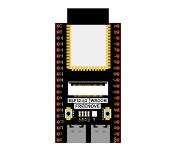
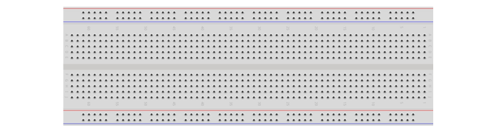
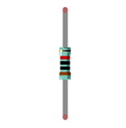
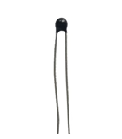

##############################################################################
Chapter Thermistor
##############################################################################

In this chapter, we will learn about thermistors which are another kind of resistor

Project 13.1 Thermometer
***********************************

A thermistor is a type of resistor whose resistance value is dependent on temperature and changes in temperature. Therefore, we can take advantage of this characteristic to make a thermometer.

Component List
================================

+-----------------------------+--------------------------+
| ESP32-S3 WROOM x1           | GPIO Extension Board x1  |
|                             |                          |
| |Chapter01_00|              | |Chapter01_01|           |
+-----------------------------+--------------------------+
| Breadboard x1                                          |
|                                                        |
| |Chapter01_02|                                         |
+-------------------+------------------+-----------------+
| Thermistor x1     | Resistor 10kΩ x1 | Jumper M/M x3   |
|                   |                  |                 |
| |Chapter13_00|    | |Chapter02_01|   | |Chapter01_05|  |
+-------------------+------------------+-----------------+

.. |Chapter01_01| image:: ../_static/imgs/1_LED/Chapter01_01.png

.. |Chapter01_05| image:: ../_static/imgs/1_LED/Chapter01_05.png
