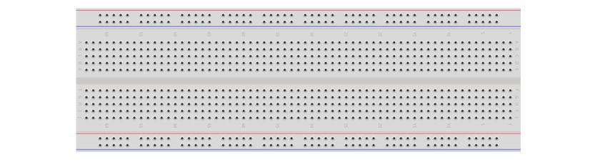

##############################################################################
Chapter Ultrasonic Ranging
##############################################################################

In this chapter, we learn a module which use ultrasonic to measure distance, HC SR04.

Project 21.1 Ultrasonic Ranging
*************************************

In this project, we use ultrasonic ranging module to measure distance, and print out the data in the terminal.

Component List
=================================

+-----------------------------+-----------------------------------------------------+
| ESP32-S3 WROOM x1           | GPIO Extension Board x1                             |
|                             |                                                     |
| |Chapter01_00|              | |Chapter01_01|                                      |
+-----------------------------+-----------------------------------------------------+
| Breadboard x1                                                                     |
|                                                                                   |
| |Chapter01_02|                                                                    |
+--------------------------------------+--------------------------------------------+
| HC SR04 x1                           | Jumper F/M x4                              |
|                                      |                                            |
| |Chapter21_00|                       | |Chapter19_02|                             |
+--------------------------------------+--------------------------------------------+

.. |Chapter01_00| image:: ../_static/imgs/1_LED/Chapter01_00.png
.. |Chapter01_01| image:: ../_static/imgs/1_LED/Chapter01_01.png

.. |Chapter19_02| image:: ../_static/imgs/19_Stepper_Motor/Chapter19_02.png

Component Knowledge
=================================

The ultrasonic ranging module uses the principle that ultrasonic waves will be sent back when encounter obstacles. We can measure the distance by counting the time interval between sending and receiving of the ultrasonic waves, and the time difference is the total time of the ultrasonic wave's journey from being transmitted to being received. Because the speed of sound in air is a constant, about v=340m/s, we can calculate the distance between the ultrasonic ranging module and the obstacle: s=vt/2.

.. image:: ../_static/imgs/21_Ultrasonic_Ranging/Chapter21_01.png
    :align: center

The HC-SR04 ultrasonic ranging module integrates both an ultrasonic transmitter and a receiver. The transmitter is used to convert electrical signals (electrical energy) into high frequency (beyond human hearing) sound waves (mechanical energy) and the function of the receiver is opposite of this. The picture and the diagram of the HC SR04 ultrasonic ranging module are shown below:

.. list-table::
   :width: 60%
   :header-rows: 1 
   :align: center
   
   * -  PCF8574 chip pin diagram:
     -  PCF8574 module pin diagram 

   * -  |Chapter21_00| 
     -  |Chapter21_02| 

.. |Chapter21_00| image:: ../_static/imgs/20_LCD1602/Chapter21_00.png
.. |Chapter21_02| image:: ../_static/imgs/20_LCD1602/Chapter21_02.png

Pin description:

+------+--------------------+
| Pin  |    Description     |
+======+====================+
| VCC  | power supply pin   |
+------+--------------------+
| Trig | trigger pin        |
+------+--------------------+
| Echo | Echo pin           |
+------+--------------------+
| GND  | GND                |
+------+--------------------+

**Technical specs:**

+--------------------------------+----------------------------------+
| Working voltage: 5V            | Working current: 12mA            |
+--------------------------------+----------------------------------+
| Minimum measured distance: 2cm | Maximum measured distance: 200cm |
+--------------------------------+----------------------------------+

Instructions for use: output a high-level pulse in Trig pin lasting for least 10us, the module begins to transmit ultrasonic waves. At the same time, the Echo pin is pulled up. When the module receives the returned ultrasonic waves from encountering an obstacle, the Echo pin will be pulled down. The duration of high level in the Echo pin is the total time of the ultrasonic wave from transmitting to receiving, s=vt/2. 

Circuit
===========================

Note that the voltage of ultrasonic module is 5V in the circuit.

.. list-table::
   :width: 100%
   :header-rows: 1 
   :align: center
   
   * -  Schematic diagram
   * -  |Chapter2Chapter21_041_03|

   * -  Hardware connection.
      
        :red:`If you need any support, please feel free to contact us via:` support@freenove.com
     -  |Chapter21_05| 

.. |Chapter21_04| image:: ../_static/imgs/19_Stepper_Motor/Chapter21_04.png
.. |Chapter21_05| image:: ../_static/imgs/19_Stepper_Motor/Chapter21_05.png         

Sketch
==============================

Sketch_21.1_Ultrasonic_Ranging
-------------------------------------------

